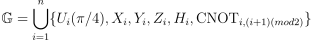
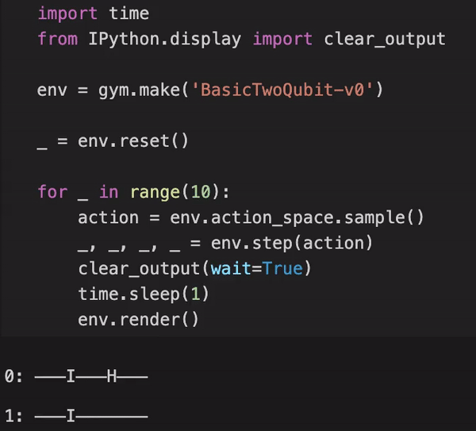

<h1 align="center" style="margin-top: 0px;"> <b>Quantum Architecture Search via Deep Reinforcement Learning</b></h1>
<div align="center" >

[](https://arxiv.org/abs/2104.07715)
[](https://quantumai.google/cirq)
[](https://www.gnu.org/licenses/gpl-3.0.html)
[](https://colab.research.google.com/github/qdevpsi3/quantum-arch-search/blob/main/notebooks/experiment.ipynb)
</div>

## **Description**
This repository contains an <ins>unofficial</ins> implementation of the <ins>Quantum Architecture Search</ins> environments and its applications as in :

- Paper : **Quantum Architecture Search via Deep Reinforcement Learning**
- Authors : **En-Jui Kuo, Yao-Lung L. Fang, Samuel Yen-Chi Chen**
- Date : **2021**

The customized <ins>Gym</ins> environments are built using <ins>Google Quantum Cirq</ins>.

## **Experiments**
The experiments in the paper are reproduced using the reinforcement learning agents provided by 
[Stable-Baselines3](https://stable-baselines3.readthedocs.io/en/master/). You can run the notebook locally or use this [Google Colab link](https://colab.research.google.com/github/qdevpsi3/quantum-arch-search/blob/main/notebooks/experiment.ipynb).

## **Details**
The agent design the quantum circuit by taking actions in the environment. Each <ins>action</ins> corresponds to a <ins>gate</ins> applied on some wires. The goal is to build a <ins>circuit</ins> *U* such that generates the <ins>target</ins> n-qubit quantum state that belongs to the environment and hidden from the agent. At each time-step, the agent receives a <ins>penalty</ins> if the <ins>fidelity</ins> between the resulting quantum state and the target is below some threshold. Otherwise, the game stops and the agent receives the fidelity minus the penalty. The environment <ins>state</ins> is computed using a pre-fixed set of <ins>observables</ins>.

This repository contains the implementation of all the environments in the paper :

- 2-qubit target and its noisy variant
- 3-qubit target and its noisy variant

Moreover, a more <ins>general environment</ins> is provided that can be built using any n-qubit target, any set of environment actions (*gates*) and any set of environment states (*observables*).

## **Setup**
To <ins>install</ins>, clone this repository and execute the following commands :

```
$ cd quantum-arch-search
$ pip install -r requirements.txt
$ pip install -e .
```

## **Environments**

### *Names*
The full list of the environments : 

- **Basic :** `'BasicTwoQubit-v0'`, `'BasicThreeQubit-v0'`, `'BasicNQubit-v0'`
- **Noisy :** `'NoisyTwoQubit-v0'`, `'NoisyThreeQubit-v0'`, `'NoisyNQubit-v0'`

### *Parameters*

Their corresponding parameters are :

| Parameters | Type | Explanation | Basic | Noisy |
|:-:|:-:|-|:-:|-|
| target | ``numpy.ndarray`` | target quantum state of size 2^n | x | x |
| fidelity_threshold | `float` | fidelity threshold, default : 0.95 | x | x |
| reward_penalty | `float` | reward penalty, default : 0.01 | x | x |
| max_timesteps | `int` | max circuit size, default : 20 | x | x |
| error_rate | `float` | measurement and gate errors, default : 0.001 |  | x |

### *Target*

By default, the target is set to :

- <ins>Bell state</ins> for the 2-qubit environments
- <ins>GHZ state</ins>  for the 3-qubit environments


### *Gates (Actions)*
The set of actions is :

<center></center>

<!-- $ \mathbb{G}=\bigcup_{i=1}^n \{ U_i(\pi/4) , X_i, Y_i, Z_i, H_i, \text{CNOT}_{i,(i+1)(mod2)} \}$ -->

### *Observables (States)*
The set of states is defined by measuring the circuit output using the following quantum observables :

<center></center>

<!-- $$ \mathbb{O}=\bigcup_{i=1}^n \{ \langle \sigma_i^x \rangle, \langle \sigma_i^y \rangle, \langle \sigma_i^z \rangle\}$$ -->

## **Example**

### *Initialization*

You can simply create your environment using : 

```python
import gym
import qas_gym

target = np.asarray([0.70710678+0.j,0. +0.j,0. +0.j, 0.70710678+0.j])

env = gym.make('BasicTwoQubit-v0', target=target, fidelity_threshold=0.95)
```

### *Evaluation*

You can train your agent and evaluate it using :

```python
state = env.reset()
done = False
while not False:
    action = agent.predict(state)
    state, reward, done, info = env.step(action)
    env.render()
```

The `info` dictionary contains the *Cirq* circuit and the *Fidelity* measure. 

### *Rendering*
You can also render the environment to see how the agent is acting.




